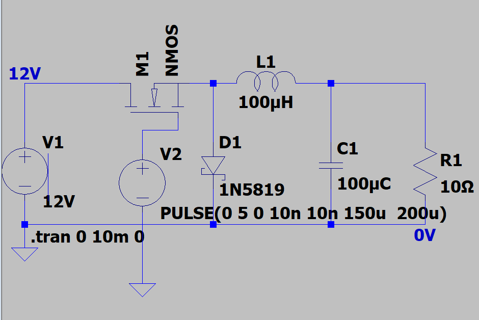
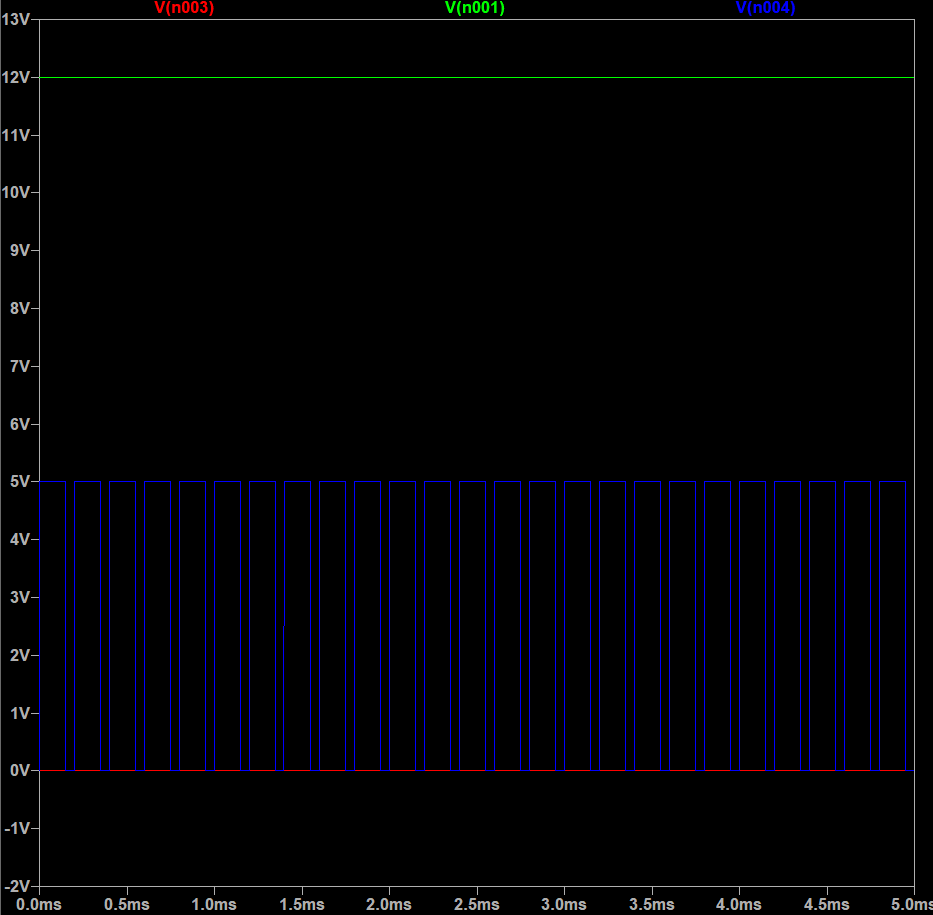

# Regulated_StepDown_Converter 12V to 5V Buck Converter – LTspice Simulation
This project simulates a basic buck converter using LTspice. 
It takes a 12V DC input and steps it down to a ~5V DC output using a PWM-controlled NMOS transistor, an inductor, diode, and capacitor.

## ⚙️ Overview
- **Simulation Tool:** LTspice
- **Input Voltage:** 12V
- **Target Output Voltage:** ~5V
- **PWM Duty Cycle:** 41.6%
- **Components Used:**
  - 1N5819 Schottky Diode
  - 100μH Inductor
  - 100μF Capacitor
  - NMOS transistor
  - 10Ω Load Resistor

## 🖥️ Schematic & Simulation
### Schematic

### Output Voltage Waveform

## 🔧 Applications
This setup models a simplified power converter for systems like EV subsystems, microcontrollers, or battery-powered IoT devices where efficiency and voltage regulation matter.

## 🧠 Takeaways
This project deepened my understanding of PWM-based switching control, passive filtering, and LTspice simulation. 
It’s my first step toward mastering power electronics and eventually working with real hardware systems.

## 🕒Future Next Steps
Design and simulate a PCB layout of the buck converter using KiCad, transitioning from LTspice simulation to real-world implementation.
Build a physical prototype using the PCB and test it with actual components and an Arduino-driven PWM signal.
Add closed-loop feedback control for dynamic voltage regulation and integrate the converter into systems like microcontrollers, sensors, or small robotics.
